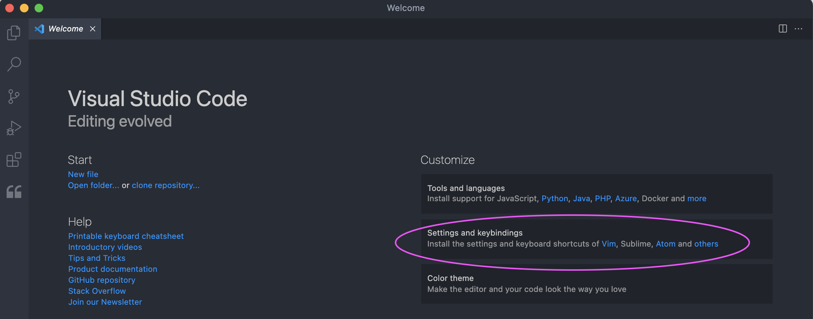
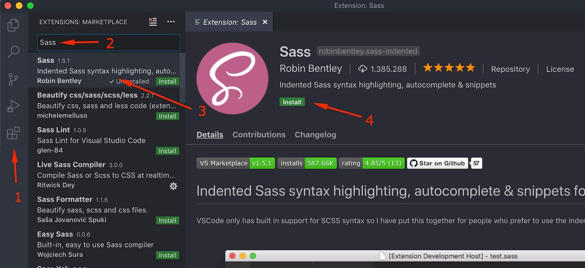
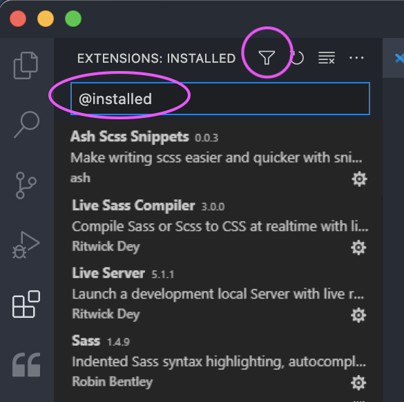

## **ENTORNO DE TRABAJO**
Es necesario que tengáis instalado git en vuestra máquina si queréis acceder al repositorio desde VSCode.  

## **VISUAL STUDIO CODE**
Trabajaremos con Visual Studio Code. Si ya lo tenéis instalado, solo hace falta que os instaléis las extensiones (punto 2.)

### **Instrucciones:**
1. 	**Descarga e instalación de VS Code:**
	Enlace de descarga: [https://code.visualstudio.com/Download](https://code.visualstudio.com/Download)

	Una cosa muy interesante de VS Code es que, al abrirlo por primera vez, os permite copiar la configuración de varios editores, algo que puede acelerar bastante vuestro ritmo de trabajo si estáis acostumbrados a trabajar con alguno de ellos.

	

2. 	**Instalación de las extensiones:**

	Las extensiones que necesitamos son las siguientes:  
	- Sass (Syler)  
	- Ash Scss Snippets 
	- Live Sass Compiler (Ritwick Dey)
	- Live Server

    Entro en la parte de “Extensiones” (1) y voy escribiendo los nombres de las extensiones necesarias en la caja de búsqueda (2), la selecciono (3) y le doy a “Install” (4).

	

3. 	Una vez instalada, donde ponía “Install” ahora pone **“Installed”**. También puede poner **“Reload”**, si es así, le damos para reiniciar VS Code.

5.  Cuando hayáis instalado todas, en la caja de búsqueda escribid: **@installed** o seleccionad **"Installed"** con el filtro, así os mostrará las extensiones que tenéis instaladas. Confirmad que son todas las que os puse arriba.

	

