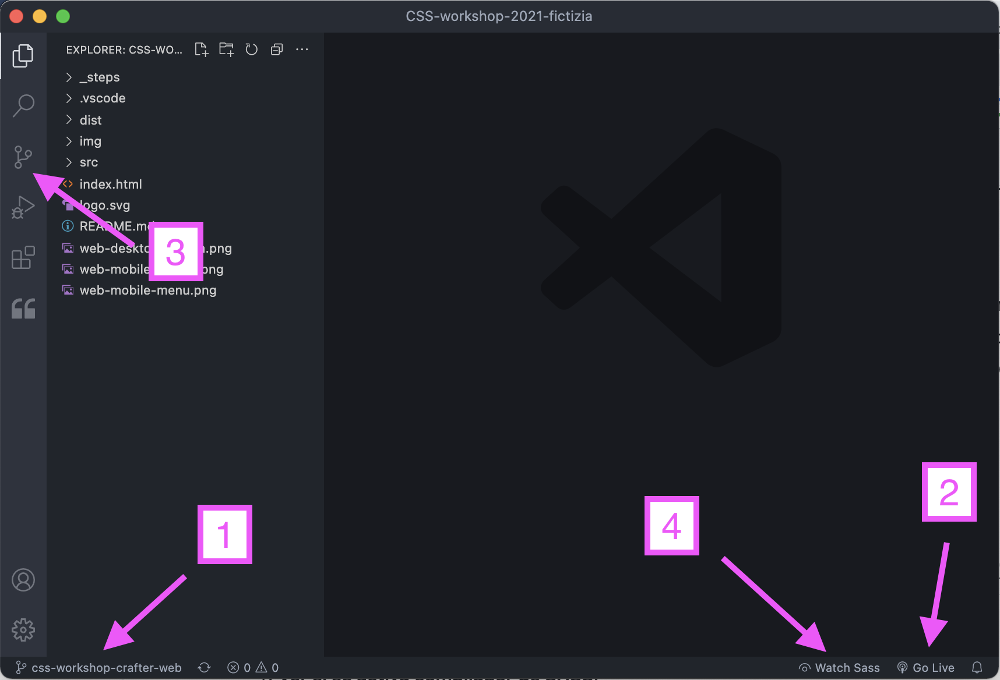

## **Probando el entorno de la rama CSS-WORKSHOP-CRAFTER-WEB**
Abrimos el proyecto desde VS Code. Podemos cambiar de rama directamente dentro del editor (1).  

Hacemos lo siguiente para probar si está todo bien:  

1. 	**Ver si se activa el visor de git (1) y el live server (2)**. (Salen en la barra de estado).

	Pulsad en "Go Live" (2) y debería abrirse el proyecto en el navegador.

	Nota: el servidor está configurado en el puerto 3001, si lo tenéis ocupado con otra cosa tenéis que cambiarlo en los user settings, si no sabéis, me lo decís.
	
	No me sale, ¿qué hago?:

	- Hay que darle un momento, en Windows a mí me tarda un poco, en Mac es casi inmediato al abrir el proyecto.
	- Si no reconoce el repositorio, pinchad en el explorador de git (3) a ver si así espabila.
	- Si no se activa el live server, poneos encima del index.html -> botón derecho -> "Open with live server".
	
	Si nada de esto funciona, haced algún plan para el día del taller y no vengáis. :-P
	
	Es broma, enviadme un mail y lo intentamos solucionar.  

2. 	**Ver si se activa compilador de SASS**.

	Tiene que salir también en la barra de estado (4) **"Watch Sass"**.  
	

	
	
	
3. 	**Poner en marcha el compilador Sass**

	Arranco el compilador pulsando donde pone **“Watch Sass”** cambiará a **“Watching…”** y en consola nos dice que está escuchando.(siguiente imagen, 1)

4. 	**Probar el compilador Sass**

	Me voy a **steps/01/_site.scss** (2), lo abro, pongo arriba del todo cualquier cosa en css (3), guardo, y **me aseguro que me está modificando styles.min.css dentro de dist/css/** (4)

5. 	**BORRO el código que he puesto de prueba** para que no nos quede ahí para el taller.

